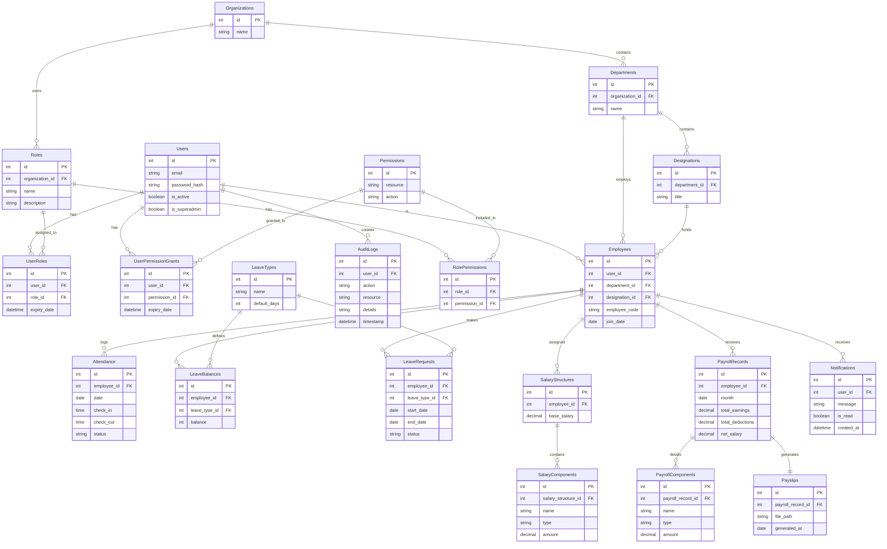

# Database ER Diagram

The following represents the core entities and their relationships for the HRMS system, focusing strongly on dynamic RBAC and comprehensive HR management.

```mermaid
erDiagram
    Users ||--o{ UserRoles : has
    Users ||--o{ UserPermissionGrants : has
    Users ||--o{ Employees : is
    Users ||--o{ AuditLogs : creates

    Organizations ||--o{ Departments : contains
    Organizations ||--o{ Roles : owns

    Roles ||--o{ UserRoles : assigned_to
    Roles ||--o{ RolePermissions : has

    Permissions ||--o{ RolePermissions : included_in
    Permissions ||--o{ UserPermissionGrants : granted_to

    Departments ||--o{ Designations : contains
    Departments ||--o{ Employees : employs

    Designations ||--o{ Employees : holds

    Employees ||--o{ Attendance : logs
    Employees ||--o{ LeaveBalances : has
    Employees ||--o{ LeaveRequests : makes
    Employees ||--o{ SalaryStructures : assigned
    Employees ||--o{ PayrollRecords : receives
    Employees ||--o{ Notifications : receives

    LeaveTypes ||--o{ LeaveBalances : defines
    LeaveTypes ||--o{ LeaveRequests : requested_as

    SalaryStructures ||--o{ SalaryComponents : contains

    PayrollRecords ||--o{ PayrollComponents : details
    PayrollRecords ||--|| Payslips : generates

    %% Entities
    Users {
        int id PK
        string email
        string password_hash
        boolean is_active
        boolean is_superadmin
    }

    Organizations {
        int id PK
        string name
    }

    Roles {
        int id PK
        int organization_id FK
        string name
        string description
    }

    Permissions {
        int id PK
        string resource
        string action
    }

    UserRoles {
        int id PK
        int user_id FK
        int role_id FK
        datetime expiry_date
    }

    RolePermissions {
        int id PK
        int role_id FK
        int permission_id FK
    }

    UserPermissionGrants {
        int id PK
        int user_id FK
        int permission_id FK
        datetime expiry_date
    }

    Departments {
        int id PK
        int organization_id FK
        string name
    }

    Designations {
        int id PK
        int department_id FK
        string title
    }

    Employees {
        int id PK
        int user_id FK
        int department_id FK
        int designation_id FK
        string employee_code
        date join_date
    }

    Attendance {
        int id PK
        int employee_id FK
        date date
        time check_in
        time check_out
        string status
    }

    LeaveTypes {
        int id PK
        string name
        int default_days
    }

    LeaveBalances {
        int id PK
        int employee_id FK
        int leave_type_id FK
        int balance
    }

    LeaveRequests {
        int id PK
        int employee_id FK
        int leave_type_id FK
        date start_date
        date end_date
        string status
    }

    SalaryStructures {
        int id PK
        int employee_id FK
        decimal base_salary
    }

    SalaryComponents {
        int id PK
        int salary_structure_id FK
        string name
        string type
        decimal amount
    }

    PayrollRecords {
        int id PK
        int employee_id FK
        date month
        decimal total_earnings
        decimal total_deductions
        decimal net_salary
    }

    PayrollComponents {
        int id PK
        int payroll_record_id FK
        string name
        string type
        decimal amount
    }

    Payslips {
        int id PK
        int payroll_record_id FK
        string file_path
        date generated_at
    }

    Notifications {
        int id PK
        int user_id FK
        string message
        boolean is_read
        datetime created_at
    }

    AuditLogs {
        int id PK
        int user_id FK
        string action
        string resource
        string details
        datetime timestamp
    }
```
